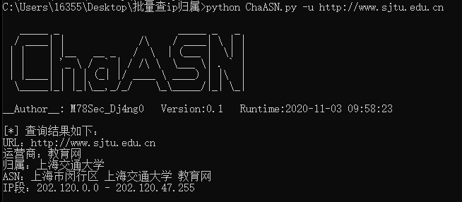
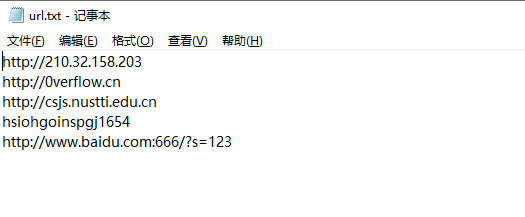
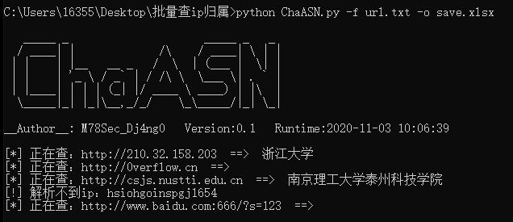
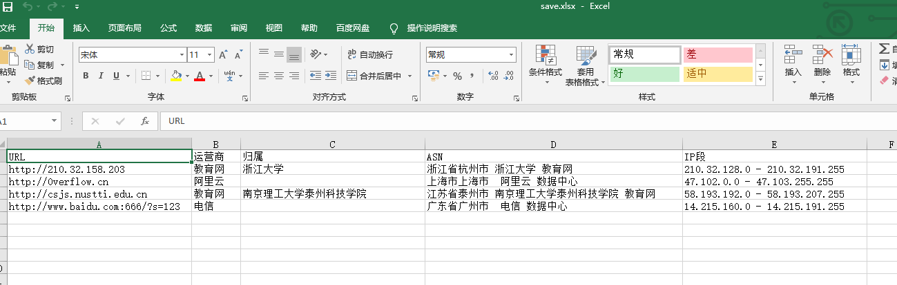

**仅供学习与测试，禁止用于违法行为，如有侵权请联系本人删除**

```
   _____ _                     _____ _   _ 
  / ____| |             /\    / ____| \ | |
 | |    | |__   __ _   /  \  | (___ |  \| |
 | |    | '_ \ / _` | / /\ \  \___ \| . ` |
 | |____| | | | (_| |/ ____ \ ____) | |\  |
  \_____|_| |_|\__,_/_/    \_\_____/|_| \_|
                                           
```

**安装依赖包：**

```
pip3 install -r requirements.txt
```

**查询单个URL地址：**

```
python ChaASN.py -u [url]
```



**批量查询：**

```
python ChaASN.py -f [url_filename] -o [output_filename.xlsx]
```

url.txt：





默认保存的文件名是 save.xlsx，仅支持导出excel 格式



**注意：查询接口封IP严重，如需大量查询请自行添加代理池**
